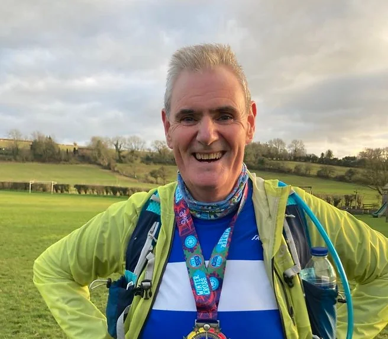
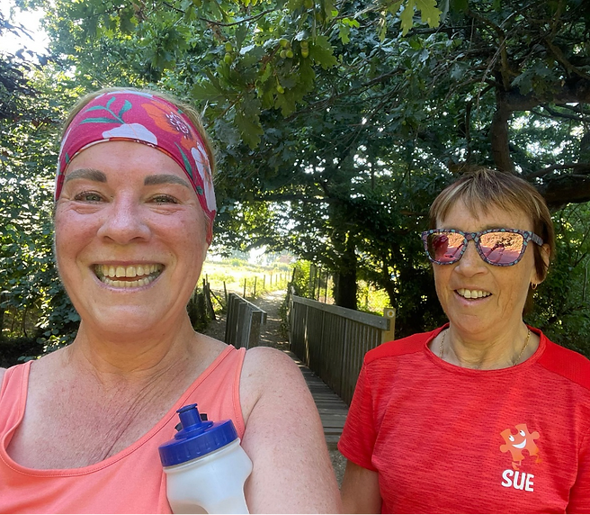
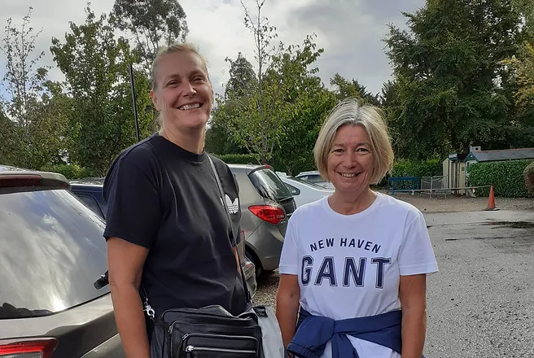
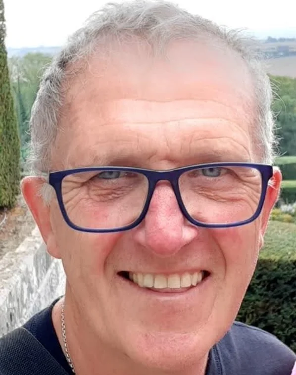
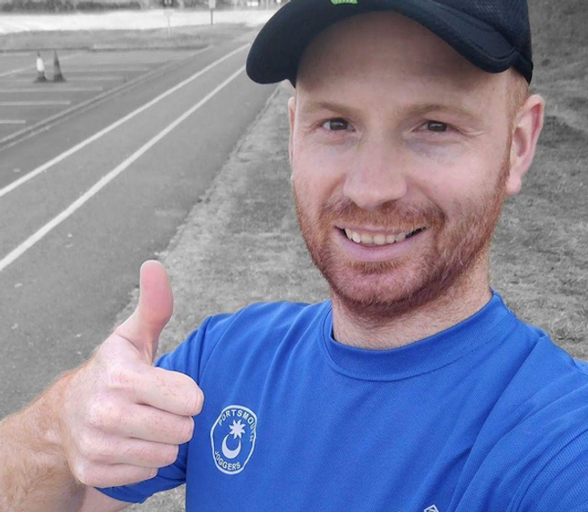
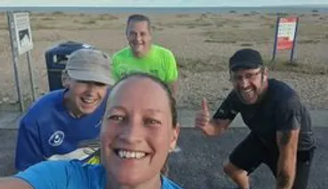

# Our Running Groups

* We have groups for all running abilities from [absolute beginners](#couch-to-5k-c25k) to [racers](#whacky-racers)
* Relative group paces are shown in this chart
  
* Additionally we have seasonal training groups for events like the Great South Run.

## Couch to 5K (C25K)
Managed by Tony Quinn and led by Tony, Sue Clarke and Sue Hyson

This course is run several times each year.  It's a nine week programme that will take you from non-runner to being able to complete 5K. The programme consists of two club sessions on a Tuesday and Thursday evening at 7pm as well as one ‘homework’ session at the weekend.

The sessions are incremental and designed to help you with regular running. The sessions are always at your own pace and we stay together as a group so that no-one gets left behind.

The programme finishes with a graduation run at Lakeside parkrun where you get to celebrate your achievement and get presented with your C25K graduation medal. The C25K programme also caters for members returning from injury or who haven’t run for a while and want to get back into the habit of running. Everyone is welcome. I completed C25K on my own over 6 years ago and have loved running ever since.

Find out more on our [Couch to 5K page](/c25k/).  😊🏃‍♀️🏃

## Early Birds 

We run from lakeside at 6 o’clock as an alternative to those who cannot make the 7 o’clock start.

We are very much a mixed paced bunch, who enjoy a social run with no emphasis on speed. There is lots of chat and plenty of laughter.

Typically we run 5-6 k on Tuesdays and 6-8k on Thursdays, with the speedier peeps looping to keep us all together.

We will be looking forward to some away runs once the clocks change. So if you occasionally need an earlier run come and join the early birds, You can be assured of a warm welcome.

## Social Runners
The Portsmouth Joggers Club Social Group is for slower runners who like to run and chat and those who need a walk from time to time. We do loop backs if needed, to keep the group together. We may occasionally do a speed work session, these are for group members who choose to do speed work, if you do not want to do speed work there will always be an alternate option.

## Next Step

Led by Sue Clarke and Sue Hyson

​
PJC Next Step group are running at a pace of approximately 7.5 minutes per kilometre (12 minutes per mile) for 30-40 minutes continuously. Every other Tuesday we do Interval training of some sort. This is to increase stamina and staying power 😊

## Inbetweeners
Led by Steve Hyson

The group is for those running at a pace of 6:00 to 6:30 mins per km (9:30 to 10:30 mins per mile), i.e. you can do Parkrun’s 5 km in around 30 mins, though anyone is welcome run with the group regardless of their pace.

On Tuesdays the group does interval training of some type which lasts an hour and normally covers 8km (5miles), on Thursdays we do a run of 9 – 10 Km (5:50 – 6:20miles).  Occasionally the group joins up with the Social Section for a joint run, typically this is when we do an ‘away run’ i.e the groups choose somewhere else to run other than our home location at Lakeside. 

Steve started running when he retired in 2018 and joined PJC in late 2019. He started leading ‘The Inbetweeners’ in January 2022.

## Pace Cadets

Led by Gina and Richard 

The Pace Cadets (formerly known as the Hermits) aim to bridge the gap between the Pacers and The Inbetweeners, catering to runners wanting to run between 9 to 10 minute miles (5:30 to 6:15 minute kilometres).

The Pace Cadets are gearing up with exciting training plans for both the Spring and Summer seasons, with a specific focus in the Summer on preparing for the Great South Run.

Gina and Richard invite you to join the Pace Cadets. If you are usually at the front of The Inbetweeners, and want to improve further, please consider moving up to the Pace Cadets!

## Whacky Racers

The Whacky Racers are led by Tony Conway and Kate Lewis.

We are the speediest group at PJC, and we typically do speed work on Tuesdays (such as 800m reps, pyramids, or hill reps) and a longer run on Thursdays. Thursday runs are usually between 7-9miles.

Group pace is 7:30-8:30m/m or 4:40-5:15m/km, with some opportunities for going faster too, for those who wish to stretch their legs out. We regularly regroup, and faster runners will loop back so that we all stay together. We always aim to have fun, so come give us a try 😊

## Pacers
Tuesdays we do group interval training.

Thursdays we do 6 to 8 miles aiming at 8:30-9 minute miles (or 5:15 to 5:35minutes per km).

## Endurance

Led By Teresa Baverstock 

My group do steady runs (no stopping) around 6miles Tuesday and Thursday current pace 8:15-9:15 min/miles