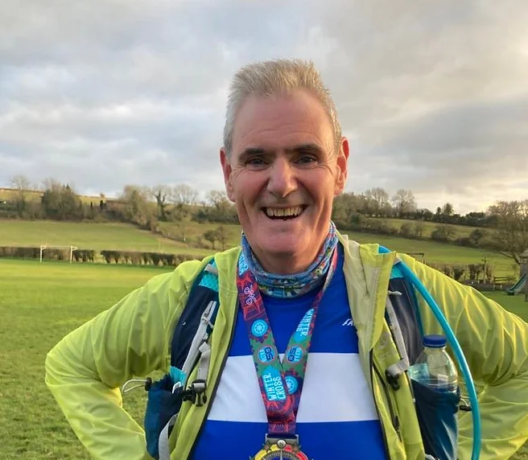
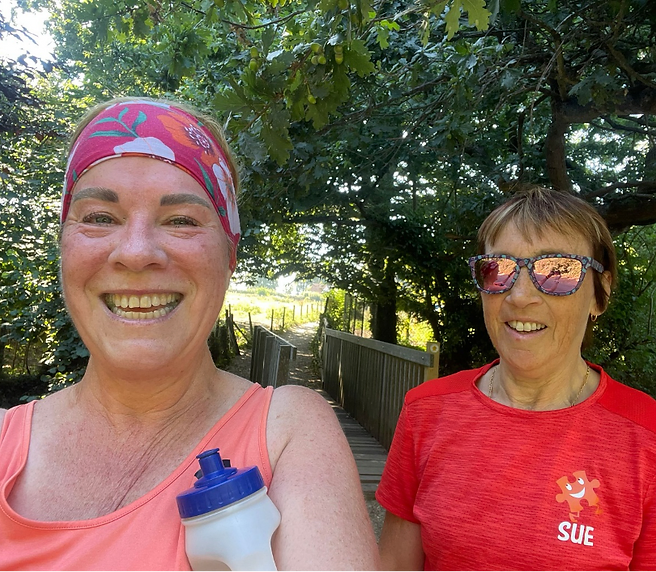

# Our Running Groups
* We have groups for all running abilities from [absolute beginners](#couch-to-5k-c25k) to [racers](#whacky-racers)
* Relative group paces are shown in this chart
  
* Additionally we have seasonal training groups for events like the Great South Run.

## Couch to 5K (C25K)
Managed by Tony Quinn and led by Tony, Sue Clarke and Sue Hyson

Several times each year we offer this nine week programme that helps non-runners get started.

The programme consists of two club sessions on a Tuesday and Thursday evening at 7pm as well as one ‘homework’ session at the weekend.

The sessions are:
* incremental - they start easy and gently increase in length each week.

* regular - because 'a little and often' is the right way to build ability.
* team based and paced - we stay together as a group so that no-one gets left behind.

Find out more on our [Couch to 5K page](/c25k/).  😊🏃‍♀️🏃

## Early Birds 

The Early Birds are run from lakeside at 6 o’clock as an alternative to those who cannot make the 7 o’clock start.  It's a mixed-pace social group, with no emphasis on speed, so expect a lot of chat and plenty of laughter.  

Early Birds typically run 5-6K on Tuesdays and 6-8K on Thursdays.  Faster runners run loops to keep the group together.

## Social Runners
Slower runners who like to run and chat, and those who need a walk from time to time, will appreciate the Social Group.  

The Social Group occasionally do speed work sessions, with alternative options for those who would prefer to focus on more gentle running.  

On runs where group members have mixed abilities loop backs are used, to keep the group together.

## Next Step

Led by Sue Clarke and Sue Hyson​

The _Next Step_ group maintains a pace of approximately 7.5 mins/km (12 mins/mile) for continuous 30-40 minute runs. Interval training is incorporated every other Tuesday to enhance stamina and endurance.

## Inbetweeners
Led by Steve Hyson

The Inbetweeners run at 6:00-30 mins/km (9:30-10:30 mins/mile) equivalent to completing a parkrun in around 30 mins.  Anyone is welcome run with the group regardless of their pace.

On Tuesdays the group does interval training of some type which lasts an hour and normally covers 8km (5miles), on Thursdays there's a run of 9–10K (5.5–6.5miles).  Occasionally the group joins up with the Social Section for a joint run, typically this happens for ‘away runs’ when the groups choose somewhere else to start and finish other than our home location at Lakeside. 

## Pace Cadets
Led by Gina and Richard 

The Pace Cadets aim to bridge the gap between the Inbetweeners and Pacers, running 5:30-6:15 mins/km (9-10 mins/mile).

## Pacers
Pacers are a faster group running 5:15-5:35 mins/km (8:30-9:00 mins/mile).
Tuesdays are typically used for interval training.
Thursday runs are usually 10-13K (6-8 miles).

## Whacky Racers
Led by Tony Conway and Kate Lewis.

Whacky Racers are the fastest group, running 4:40-5:15 mins/km (7:30-8:30 mins/mile), with some opportunities for going faster too for those who wish to stretch their legs out.  Faster runners loop back to keep the group together.

Tuesdays are typically speed work (such as 800m reps, pyramids, or hill reps).
Thursday runs are usually between 11-14K (7-9miles).

## Endurance

Led By Teresa Baverstock 

The Endurace group do steady (no stopping) runs for on most club nights at a pace around 4:50-5:45 mins/km (7:45-9:15 mins/mile)
